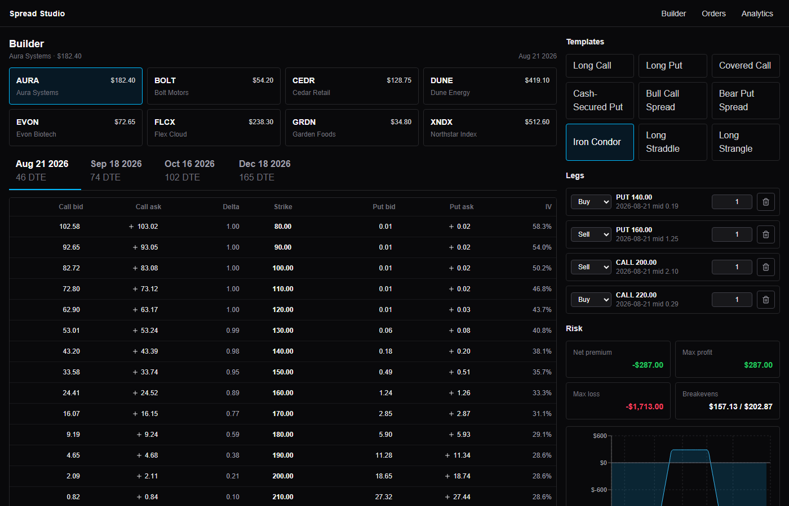
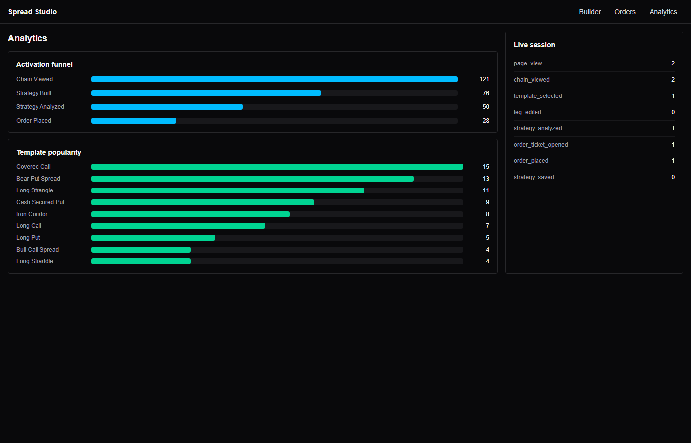
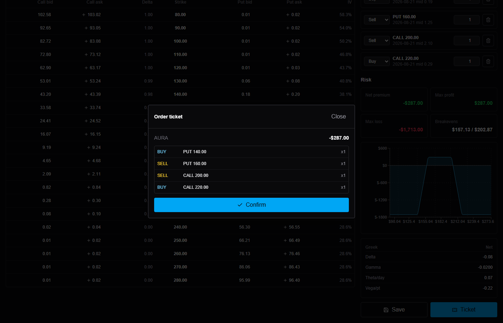

# Spread Studio

[](https://github.com/financebrochefgamer/spread-studio/actions/workflows/ci.yml)

A multi-leg options strategy builder, spec'd by a product manager and built by AI agents
using GitHub Spec Kit, Claude Code, and Codex. A passion project practicing spec-driven,
AI-first product development on an active-trader derivatives product.

**Live demo:** https://spread-studio.vercel.app



## What it does

- Explore deterministic synthetic option chains for 8 underlyings with Black-Scholes
  pricing, volatility skew, 4 expirations, and 21 strikes.
- Build strategies from 9 templates or leg by leg from the chain.
- See payoff at expiration, breakevens, max profit/loss, net debit/credit, and Greeks
  while building.
- Place simulated mid-price orders and review them in order history.
- Save and reload strategies.
- Open /positions to see orders become open positions marked to model, stress them with
  a spot/vol/time scenario engine, and close them for realized P&L.
- Open /analytics to review the activation funnel, template popularity, and live session
  events from the tracking plan.



## Why this repo exists

It is a working demonstration of spec-driven product development with AI agents.

| Artifact | Role |
| --- | --- |
| [.specify/memory/constitution.md](.specify/memory/constitution.md) | Project principles the agent must obey |
| [docs/product/discovery-brief.md](docs/product/discovery-brief.md) | Personas and jobs-to-be-done |
| [docs/product/success-metrics.md](docs/product/success-metrics.md) | Tracking plan written before the code |
| [specs/001-options-strategy-builder](specs/001-options-strategy-builder) | spec.md, plan.md, tasks.md and design artifacts |
| [specs/002-positions-scenario-analysis](specs/002-positions-scenario-analysis) | Second spec cycle: spec PR reviewed to APPROVE across two rounds, then plan, tasks, implementation |
| [docs/process/ai-workflow.md](docs/process/ai-workflow.md) | How the human and AI split worked |
| [docs/process/agent-handoff-review.md](docs/process/agent-handoff-review.md) | Mid-build agent swap and the independent review that followed |
| [docs/product/roadmap.md](docs/product/roadmap.md) | What was deferred and why |
| [docs/product/role-gap-analysis.md](docs/product/role-gap-analysis.md) | Honest gap analysis against a target role and the resulting spec queue |

The commit history reads oldest-first as: design, Spec Kit setup, product docs, spec,
plan, tasks, then implementation. Spec 002 repeats the full cycle, including a public
spec review session as a PR (specs/002, PR history) before any implementation code.

## Simulated order flow



## Run it

```bash
npm install
npm run dev
npm run test
npm run build
npm run test:e2e
```

Open `http://localhost:3000`.

No API keys, no database, no auth, and no network calls are required by the app. Market
data is generated from fixed inputs, so every run is identical.

## Disclaimers

All market data is simulated. Orders are simulated. Nothing here is investment advice or a
brokerage service.
